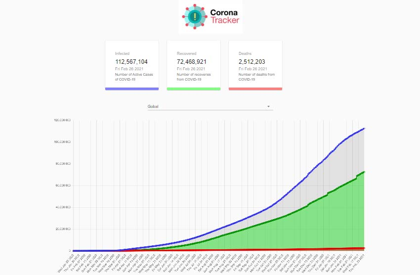

#  Covid -19 Tracker - This app shows the no of confirmed, recovered, and deaths cases during Covid using a External API 
And also the Covid cases for specify Country using ISO 3166-2 location code

API provided by https://rapidapi.com/ - API use - https://rapidapi.com/SmartableAI/api/coronavirus-smartable/

Technology used:
1. HTML, CSS, JS
2. React.js
3. Chart.js -for Bar and Line Chart
4. External API's -  for Covid Stats

